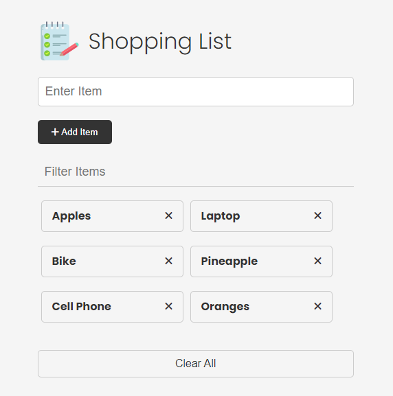

# Shopping List Web App

This is a simple shopping list web application built using HTML, CSS, and JavaScript. It allows users to add, remove, edit, and filter items in their shopping list. The application utilizes local storage to persist the list items even after refreshing the page.

## Features

- Add items to the shopping list.
- Remove items from the list.
- Edit existing items.
- Filter items by name.
- Clear all items from the list.
- Persist data using local storage.

## Live at

You can try the app live [here](https://hsatya.github.io/shopping-list-v1/).

## Usage

To use the shopping list web app:

1. Clone or download this repository.
2. Open the index.html file in a web browser.
3. Enter the item name in the input field and click "Add Item" to add it to the list.
4. To remove an item, click on the red "X" button next to it.
5. To edit an item, click on the item text itself, make changes, and click "Update Item".
6. Use the filter input field to search for specific items by name.
7. Click "Clear All" to remove all items from the list.

## Dependencies

This project does not require any external dependencies beyond what is included in the HTML file.

## Acknowledgments

This project was inspired by various online tutorials and resources on building interactive web applications with vanilla JavaScript. Special thanks to those who provided guidance and inspiration.
